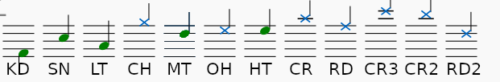

Examples
========

The `test directory in GitHub
<https://github.com/com-posers-pit/smw_music/blob/develop/tests/>`_
contains examples that show how to use the tool.
MusicXML files are in the ``src`` directory, and generated MML files are
in the ``dst`` directory.
Files in ``src/bad`` are design to generate errors and have no
corresponding MML files.

Feature List
============

The tool supports the following features:

- Up to 8 monophonic channels/parts/staves of music.
  If more are provided, only the first eight are used.
  Chords and multi-voice parts generate an error.
  Staves are delimited by comments.

- Composer and title extraction.
  These must be set in the score metadata, the displayed on the sheet
  music is ignored.

- Automatic tempo calculation.
  The quarter note BPM tempo is converted to the corresponding
  MML ``t`` directive.

- Pitched notes (and rests) in any clef and with 8va/15ma/22ma
  alta/bassa.
  Whole notes through 64th notes are supported, including triplets,
  dots, and ties.

- Notes outside what AddMusicK can support generate an error.

- Automatic default octave and note-length calculation.
  These are updated at the beginning of each part.
  Octave up/down directives are used whenever possible.

- Slurs.
  These use the ``LEGATO_ON`` and ``LEGATO_OFF`` macros

- `Percussion`_
  As noted above, only monophonic parts are supported; drums/cymbals
  must be split into different staves.
  Named instrument macros are used and inserted before each note.

- Invalid percussion instruments generate an error.

- Staccato and accented articulations.
  These use the
  ``qACC_ON`` / ``qACC_OFF`` / ``qSTAC_ON`` / ``qSTAC_OFF`` / ``qDEF``
  macros.
  Articulations do not change across tied notes.

- Grace notes
  These are all implemented as slurred appoggiatura that take 8 ticks
  from the principal note.

- Dynamics, ``PPPP`` through ``FFFF``.
  These are implemented as ``vPPPP`` through ``vFFFF`` macros.
  They are given default values at the beginning of each stave.

- Porter-defined loops.
  A loop is defined by a horizontal line element that covers a set of
  notes.
  Optionally, loops are sequentially labeled and start with 100 times
  the staff number.

- Loop repeats and references are automatically detected and inserted.

- Optionally, runs of more than 3 repeated notes/rests outside of a
  user-defined loop are converted into a superloop.

- A single repeat-start bar is converted into a loop point directive
  ``/``
  If this is left out, the directive is included at the start of the
  score.

- Manually inserting text into the MML file by using a text expression
  that starts with ``AMK:``
  This can be used for changing instruments and any other custom MML.

- Optionally include global legato via ``$F4$02``

- All notes/rests in a measure are written to a single line.
  Optionally, the measure number can be written in a comment at the end
  of the lines.

- Rehearsal marks in the score are converted to section-header comments.

- Build date+time and tool version logging in a header comment.

- Echo configuration calculation and insertion

- Optional instrument name detection

  - Any text that starts with ``To`` is converted to a macro and
    inserted into the score.

      - This convention is supported by at least MuseScore, Sibelius,
        and Finale

  - The same holds for any ``AMK: @XYZ`` annotation that only has an
    ``@`` symbol followed by text

  - The same holds for a part's main instrument

  - Spurious instrument names can be emitted (especially for percussion
    staves)

  - Search for the word ``PORTER`` to find the instrument definitions
    section near the top of the document

  - If an instrument name contains an entry in the table below, the
    sample number is used.  Sample 0 is used by default.

========== ========
Instrument Sample #
---------- --------
Flute      0
Marimba    3
Cello      4
Trumpet    6
Bass       8
Piano      13
Guitar     17
Default    0
========== ========

.. _Percussion:

Percussion
==========

Staves with the neutral clef are treated as percussion parts.

The following instruments are supported, using the indicated instrument
name macros:

======= ===============
Macro   Instrument
------- ---------------
``KD``  bass/kick drum
``LT``  low tom-tom
``SN``  snare drum
``MT``  mid tom-tom
``HT``  high tom-tom
``RD``  Ride cymbal
``OH``  Open hi-hat
``CH``  Closed hi-hat
``CR``  Crash cymbal
``CR2`` Crash cymbal 2
``CR3`` Crash cymbal 3
``RD2`` Ride cymbal 2
======= ===============

Whenever a percussion part is included in a score, these macros are
defined in the file header with default SMW instrument.

The tool follows Norman Weinberg's `Guidelines for Drumset Notation
<http://www.normanweinberg.com/uploads/8/1/6/4/81640608/940506pn_guildines_for_drumset.pdf>`_
recommendations, with the exception of the open hi-hat:

|

`MuseScore v4.0 <https://github.com/com-posers-pit/smw_music/blob/develop/misc/mml_v4.00.drm>`_
and
`MuseScore v3.6 <https://github.com/com-posers-pit/smw_music/blob/develop/misc/mml_v3.02.drm>`_
drumset definition files are available on GitHub that include all supported
percussion instruments.
We recommend using this to ensure you're using the correct notation.
